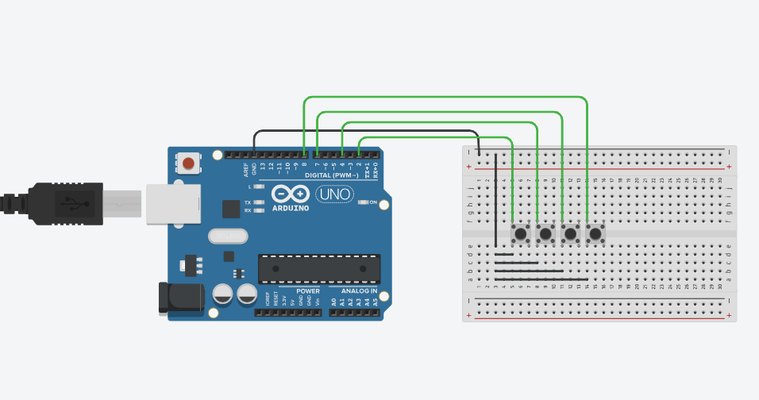

# AutoFefe :rocket:

Este projeto foi desenvolvido para a disciplina M4AMA 2023, e tem como propósito a criação de um núcleo de automatização físico caseiro e de baixo custo!

#### Sobre o Hardware

O Arduino é uma plataforma de prototipagem eletrônica de hardware livre e de placa única, projetada com um microcontrolador Atmel AVR relativamente poderoso com suporte de entrada/saída embutido, o que o torna excepcional para uso em prototipagem de dispositivos físicos interativos conectados a um software, como por exemplo, sensores, robôs, controladores MIDI, etc.

A possibilidade de interação de hardware permite, por exemplo, que o microcontrolador realize medições de temperatura e umidade e envie os dados para o computador ou celular (a ser implementado), que por sua vez, pode tomar decisões baseadas nesses dados, como ligar um ventilador ou um aquecedor. :fire: :snowflake:

O objetivo do projeto é criar ferramentas que são acessíveis, com baixo custo, flexíveis e fáceis de se usar por principiantes e profissionais. O Arduino, por ser de hardware livre e amplamente utilizado, propicia a melhor acessibilidade.

##### Integração de plataformas

AutoFefe foi desenvolvido para enviar e receber comandos de um computador ou celular (a ser implementado) utilizando o protocolo UART, possibilitando a execução de scripts de automação mais pesados e complexos

#### Exemplos de uso

O núcleo vem com alguns modulos implementados [veja a seção de modulos](#modulos) para mais detalhes. :wrench:

## Requerimentos

Para a execução do nucleo python, você precisa ter instalado o [python 3.8](https://www.python.org/downloads/release/python-3818/) ou superior.

você também precisará gravar o sketch do arduino no seu arduino, para isso você precisará do [Arduino IDE](https://www.arduino.cc/en/software) ou de um [programador ISP](https://www.arduino.cc/en/Tutorial/BuiltInExamples/ArduinoISP).

## Uso

Para utilizar o nucleo, você precisará, caso necessário, fazer alterações no arquivo *Autofefe.py*, e gravar o sketch do arduino no seu microcontrolador.

Caso for utilizar os modulos padrões, você precisará conectar os seguintes componentes ao seu arduino:

tendo conferido isso, você pode executar o nucleo com o arquivo *Autofefe.bat*

## Modulos

## Problemas conhecidos

- O nucleo não funciona em sistemas operacionais que não sejam windows.
- O nucleo ainda não possui uma interface gráfica.
- O nucleo ainda não possui 100% de modularidade.
- O nucleo ainda não possui uma documentação completa.
- Testes de estabilidade ainda não foram realizados.
- O sketch é específico para o arduino e pode não funcionar em outros microcontroladores.

## Sugestões de melhorias

- Adicionar opção básica para adicionar e remover tarefas no módulo de tarefas.
- Melhorias de estabilidade, modularidade e eficiência.
- Criação de uma interface gráfica.
- Implementação de interação com celular (via comunicação sem fio ou ponte Computador-Celular).
- Criar Scrip de gravação do sketch para gravação via ISP.
